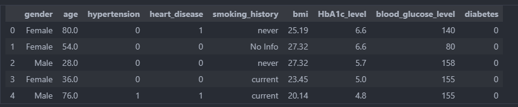
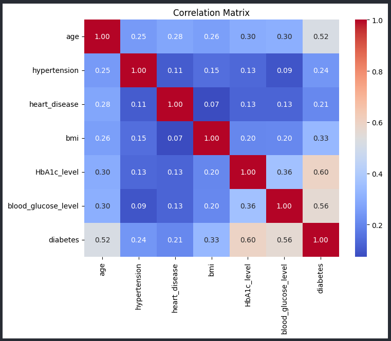
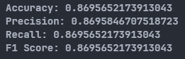

# Diabetes Prediction using K-Nearest Neighbors algorithm Without KNN Library

## Overview :
This project aims to develop a machine learning model to predict diabetes using the K-Nearest Neighbors (KNN) algorithm without KNN library. The model utilizes patient data such as glucose level, blood pressure, insulin level, etc., to predict the likelihood of a person having diabetes.

## Requirements :
- numpy
- pandas
- matplotlib
- seaborn
- scikit-learn
- scipy

## Dataset : 
### Dataset Source : [Kaggle](https://www.kaggle.com/datasets/iammustafatz/diabetes-prediction-dataset/data)

| Attribute Name | Attribute Name |
| ------------- | ------------- |
| gender | Age | 
| hypertension | heart_disease |
| smoking_history | bmi |
| HbA1c_level | blood_glucose_level |
| diabetes |

## Methodology:
1. Data Preprocessing: Cleaning the dataset, handling missing values, Anomaly and Outlier, and encoding categorical & nominal.
2. Feature Selection: Identifying relevant features that contribute significantly to the prediction of CKD.
3. Model Training: Implementing the K-NN algorithm.
4. Model Evaluation: Assessing the performance of the model using appropriate metrics such as accuracy, precision, recall, and F1-score.

## Preview
### Dataset Preview

### Correlation Matrix

### Accuracy Result


## Usage
1. Clone the repository :
```` Git
git clone https://github.com/DikkiKartajaya/DiabetesPrediction_KNN.git
````
2. Install the required dependencies :
```` Python
pip install -r requirement.txt
````
3. Run the Jupyter notebook DiabetesPrediction_KNN.ipynb to train and evaluate the KNN model.

## Contribution :
Contributions to the project are welcome! If you have any suggestions for improvement, feature requests, or bug reports, please feel free to open an issue or submit a pull request.
